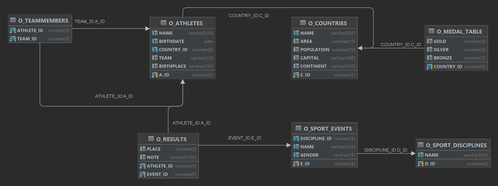

[↑ Back](./README.md)

# `C201` - Subselects, matrix (2D) result

## Schema diagram



## Exercises

1. Return the **average number of countries per continent**.

   ```sql
   SELECT AVG(countries)
   FROM (
      SELECT continent, COUNT(*) AS countries
      FROM o_countries
      GROUP BY continent
   );
   ```

1. Return the **average number of countries per continent**. Do not deal with countries whose continent is unknown.

   ```sql
   SELECT AVG(countries)
   FROM (
      SELECT continent, COUNT(*) AS countries
      FROM o_countries
      WHERE continent IS NOT NULL
      GROUP BY continent
   );
   ```

1. Return each **continent** and the **number of corresponding countries**. Return a continent if it has more countries than the average.

   ```sql
   SELECT continent, COUNT(*) AS countries
   FROM o_countries
   GROUP BY continent
   HAVING COUNT(*) > (
      SELECT AVG(countries)
      FROM (
         SELECT continent, COUNT(*) AS countries
         FROM o_countries
         WHERE continent IS NOT NULL
         GROUP BY continent
      )
   );
   ```

1. Return each **capital** with the **number of capitals** beginning with the same letter.

   ```sql
   SELECT capital, capitals
   FROM o_countries
      JOIN (
         SELECT SUBSTR(capital, 1, 1) AS letter, COUNT(*) AS capitals
         FROM o_countries
         GROUP BY SUBSTR(capital, 1, 1)
      )
      ON letter = SUBSTR(capital, 1, 1);
   ```

1. Return the **name**, the **continent**, and the **population** of each country that has the greatest population in its continent.

   ```sql
   SELECT name, continent, population
   FROM o_countries
      NATURAL JOIN (
         SELECT continent, MAX(population) AS greatest
         FROM o_countries
         GROUP BY continent
      )
   WHERE population = greatest;
   ```

1. Return each **continent** and its **gold medals** if it is greater than the average.

   It was a homework. :)
